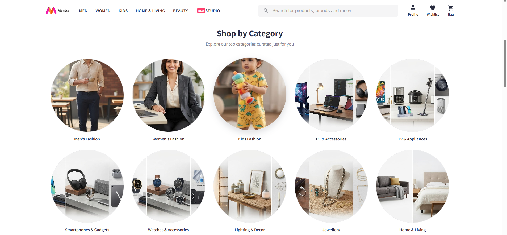

# Myntra Clone 🛍️

A front-end clone of the Myntra e-commerce website, built using **HTML** and **CSS** only.


## 🔗 Live Demo

👉 [View Live Project](https://aryan24cse109-dev.github.io/Myntra-Clone/)

## 📌 About the Project

This project replicates the user interface of Myntra's website, focusing on layout, styling, and visual design. It was built purely with HTML and CSS as a practice project to strengthen front-end development fundamentals — no JavaScript, frameworks, or libraries were used.

## 🚀 Features

- Responsive header with logo and navigation bar
- Navigation menu with categories: Home & Living, Beauty, Studio (with "NEW" badge), and more
- Underline hover effect on navigation items
- Search bar with search icon and placeholder text
- Header icons section (Profile, Wishlist, Bag, etc.)
- Clean, modern UI closely inspired by Myntra's actual design

## 🛠️ Built With

- **HTML5** – Page structure and content
- **CSS3** – Styling, layout, and visual design

## 📂 Project Structure

```
myntra-clone/
│
├── images/         # Image assets used in the project
├── index.html      # Main HTML file
├── index.css        # Stylesheet
├── .gitignore
└── README.md
```

## 💻 Getting Started

Follow these steps to run the project locally:

1. Clone or download this repository
   ```bash
   git clone <your-repo-link>
   cd myntra-clone
   ```
2. Open the folder in VS Code (or any code editor)
3. Open `index.html` using the **Live Server** extension, or simply double-click the file to open it in your browser

## 📸 Preview

*(Add a screenshot of your project here)*

```markdown

```

## 🔮 Future Improvements

- Add JavaScript for interactivity (dropdowns, search functionality, cart)
- Make the layout fully responsive for mobile and tablet screens
- Add product listing and filter sections
- Implement a working cart and wishlist UI

## 📝 Note

This project was built for **educational and practice purposes only**. It is not affiliated with, endorsed by, or connected to Myntra in any way. All rights to the original design belong to Myntra.

## 🙋‍♂️ Author

Made with ❤️ by **[Your Name]**

- GitHub: [ARYAN AGARWAL](https://github.com/aryan24cse109-dev)
- LinkedIn: [Aryan Agarwal](https://www.linkedin.com/in/aryan-agarwal-7829b4297/)

## 📄 License

This project is open source and free to use for learning purposes.
